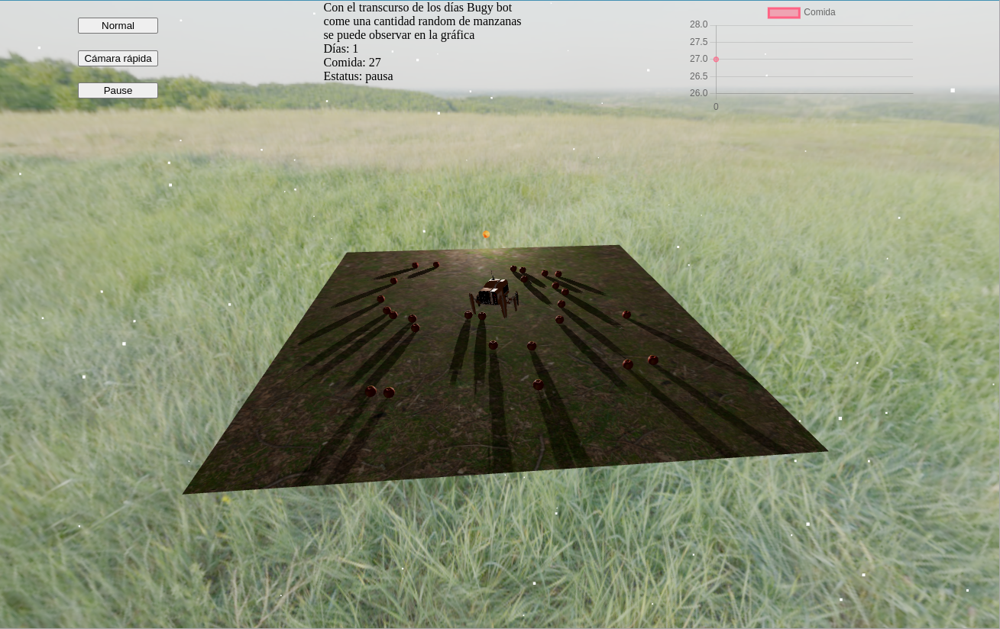
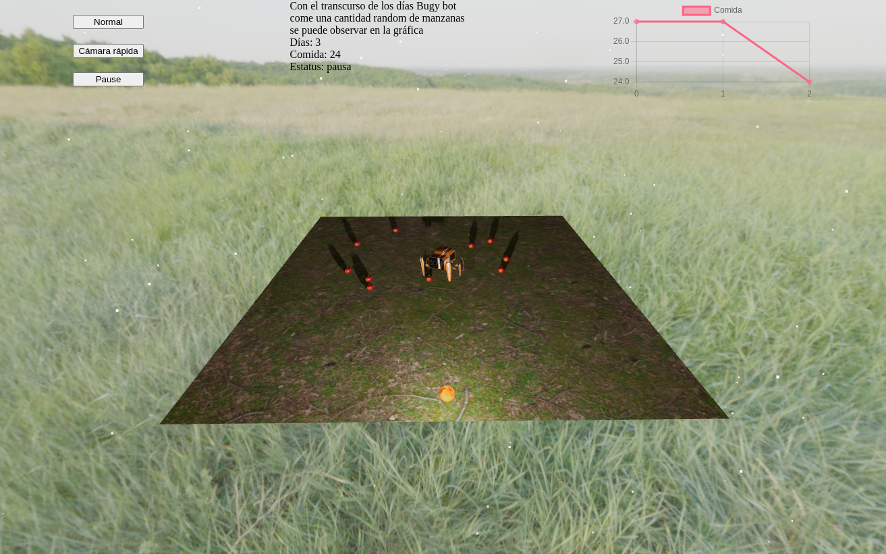
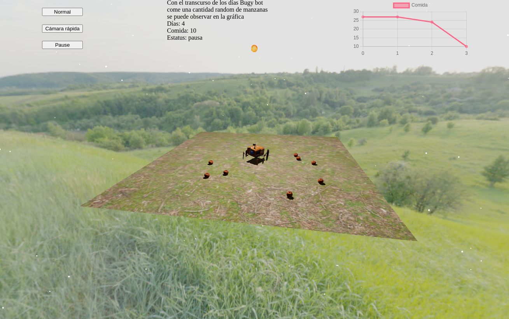
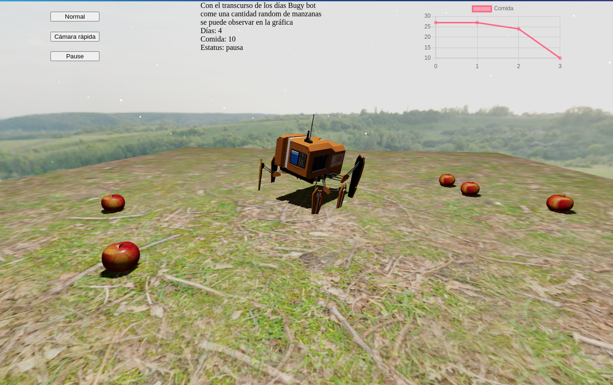

# Bugy bot

La escena consiste de _Bugy bot_ el cual es un bot postapocaliptico viviendo en un entorno rodeado por una cantidad aleatoria de manzanas, de las cuales depende su supervivencia, aunque es un misterio el cómo las consume, solo desaparecen día con día. Hay días que solo come una u otros que come bastantes.

- URL: https://61fdd6728a748a0008eaf58a--naughty-swanson-d549e2.netlify.app/
- Video: https://youtu.be/GXybKXQbQdE





## Recursos

Los recursos utilizados en el proyecto fueron obtenidos de los siguientes enlaces:

1. [Textura en el suelo](https://polyhaven.com/a/forrest_ground_01)
1. [Background](https://polyhaven.com/a/spaichingen_hill)
1. [Manzana](https://sketchfab.com/3d-models/apple-fbx-b496adbf9b924ff99939ad38330eb3cf)
1. [Bug bot](https://sketchfab.com/3d-models/bug-bot-23faa9598a9a4749bd2f54a1946eb227)
1. [Sol](https://www.solarsystemscope.com/textures/)

## Correr el proyecto

```sh
git clone git@github.com:robtry/bugy-bot.git
cd bugy-bot
yarn install
yarn start
```

## Tecnologías

El proyecto está realizado utilizando las siguientes herramientas

- [react-three-fiber](https://docs.pmnd.rs/react-three-fiber/getting-started/introduction). El cual funciona como React renderer de three.js.
- [eact-three/cannon](https://www.npmjs.com/package/@react-three/cannon). Quien en conjunto con `react-three-fiber` permite manejar física dentro de la escena.
- [gltfjsx](https://github.com/pmndrs/gltfjsx). Permite convertir modelos en 3D a código de `react-three-fiber`.
- [Zustand](https://github.com/pmndrs/zustand). El cual un administrador del estado.

## Estructura

El proyecto sigue la estructura tradicional de un proyecto de React

```txt
public
- apple // Archivos del modelo de la manzana
- exe // Archivos del modelo de Bugy bot
src
- assets // Aqui se encuentran los assets de la escena
- components // Los demás componentes que crean la escena
- - models Los archivos ya importados de los Modelos
- store // Los archivos que corresponden al manejo de la app
- utils // Funciones auxiliares
App.tsx // Donde se arma la escena completa
index.tsx // Donde se hace la configuración entre App y donde se renderea
```
